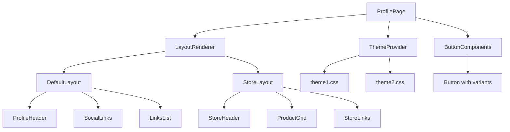
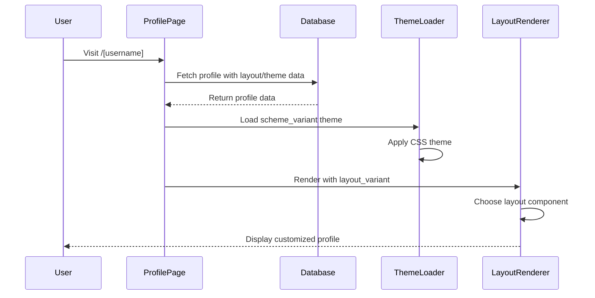

# Layout and Themes Implementation Design

## Overview

This design document outlines the implementation of a layout and themes feature for user profiles. The system will allow users to customize their profile appearance through layout variants, theme schemes, and button styles. The implementation focuses on the profile display page (`/[profile]`) with configuration stored in the profiles table.

## Technology Stack & Dependencies

- **Frontend**: React, Next.js, TypeScript
- **Styling**: Tailwind CSS, CSS Custom Properties
- **Database**: PostgreSQL with Drizzle ORM
- **State Management**: React hooks (useState, useEffect)
- **Component Library**: Radix UI components

## Architecture

### Database Schema Modifications

The profiles table will be extended with three new fields:

```typescript
// Additional fields in profiles table
export const profiles = pgTable("profiles", {
  // ... existing fields
  
  // Layout and theming options
  layout_variant: text("layout_variant").default("default"), // "default" | "store"
  scheme_variant: text("scheme_variant").default("theme1"), // "theme1" | "theme2" 
  button_variant: text("button_variant").default("default"), // matches button.tsx variants
  
  // ... rest of existing fields
});
```

### Component Architecture



### Layout Variants

#### 1. Default Layout
- Single column centered design
- Profile header with avatar and bio
- Social links horizontal layout
- Links displayed as buttons in vertical stack
- Suitable for content creators and influencers

#### 2. Store Layout  
- Two-column grid layout on desktop
- Product showcase emphasis
- Enhanced call-to-action buttons
- Category filtering for links/products
- Optimized for e-commerce and digital products

### Theme System Implementation

#### Static Theme Files
- `theme1.css`: Minimal monospace theme with subtle shadows
- `theme2.css`: Colorful theme with bold shadows and DM Sans font
- Themes applied via CSS custom properties
- No database storage required - themes are static assets

#### Theme Application Strategy
```typescript
// Theme loading strategy
const loadTheme = (schemeVariant: string) => {
  // Remove existing theme
  const existingTheme = document.getElementById('profile-theme');
  if (existingTheme) {
    existingTheme.remove();
  }
  
  // Load new theme
  const link = document.createElement('link');
  link.id = 'profile-theme';
  link.rel = 'stylesheet';
  link.href = `/themes/${schemeVariant}.css`;
  document.head.appendChild(link);
};
```

## Component Design

### Layout Components

#### DefaultLayout Component
```typescript
interface DefaultLayoutProps {
  profile: ProfileData;
  links: LinkData[];
  buttonVariant: string;
}

const DefaultLayout: React.FC<DefaultLayoutProps> = ({
  profile,
  links, 
  buttonVariant
}) => {
  return (
    <div className="min-h-screen flex flex-col items-center justify-center p-4 max-w-2xl mx-auto">
      <ProfileHeader profile={profile} />
      <SocialLinks socialLinks={profile.socialLinks} />
      <LinksList links={links} buttonVariant={buttonVariant} />
    </div>
  );
};
```

#### StoreLayout Component
```typescript
const StoreLayout: React.FC<DefaultLayoutProps> = ({
  profile,
  links,
  buttonVariant
}) => {
  return (
    <div className="min-h-screen bg-background">
      <div className="max-w-6xl mx-auto p-4">
        <div className="grid grid-cols-1 lg:grid-cols-3 gap-8">
          <div className="lg:col-span-1">
            <ProfileHeader profile={profile} compact />
            <SocialLinks socialLinks={profile.socialLinks} vertical />
          </div>
          <div className="lg:col-span-2">
            <ProductShowcase links={links} buttonVariant={buttonVariant} />
          </div>
        </div>
      </div>
    </div>
  );
};
```

### Theme Integration

#### ThemeLoader Component
```typescript
interface ThemeLoaderProps {
  schemeVariant: 'theme1' | 'theme2';
}

const ThemeLoader: React.FC<ThemeLoaderProps> = ({ schemeVariant }) => {
  useEffect(() => {
    // Load theme CSS dynamically
    import(`@/lib/themes/${schemeVariant}.css`);
    
    // Apply theme class to body
    document.body.className = `theme-${schemeVariant}`;
    
    return () => {
      // Cleanup on unmount
      document.body.className = '';
    };
  }, [schemeVariant]);
  
  return null;
};
```

### Button Variant Integration

#### Enhanced Button Implementation
```typescript
interface ProfileButtonProps extends ButtonProps {
  variant: 'default' | 'destructive' | 'outline' | 'secondary' | 'ghost' | 'link';
  href: string;
  children: React.ReactNode;
}

const ProfileButton: React.FC<ProfileButtonProps> = ({
  variant,
  href,
  children,
  ...props
}) => {
  return (
    <Button asChild variant={variant} {...props}>
      <a
        href={href}
        target="_blank"
        rel="noopener noreferrer"
        className="w-full justify-between"
      >
        {children}
        <ArrowUpRight className="w-4 h-4" />
      </a>
    </Button>
  );
};
```

## Data Flow

### Profile Page Loading Sequence



### Data Interface

```typescript
interface ProfileData {
  id: string;
  username: string;
  displayName: string;
  bio?: string;
  avatar?: string;
  backgroundImage?: string;
  isPublic: boolean;
  socialLinks?: Record<string, string>;
  
  // New theming fields
  layout_variant: 'default' | 'store';
  scheme_variant: 'theme1' | 'theme2';
  button_variant: 'default' | 'destructive' | 'outline' | 'secondary' | 'ghost' | 'link';
}
```

## Implementation Strategy

### Phase 1: Database Schema Update
1. Add new columns to profiles table
2. Create migration script
3. Update TypeScript interfaces
4. Modify profile API endpoints

### Phase 2: Layout Components
1. Create `LayoutRenderer` component
2. Implement `DefaultLayout` component
3. Implement `StoreLayout` component
4. Add layout switching logic

### Phase 3: Theme System
1. Create `ThemeLoader` component
2. Implement theme CSS loading mechanism
3. Ensure theme isolation between profiles
4. Test theme switching performance

### Phase 4: Button Variants
1. Enhance button component integration
2. Create `ProfileButton` wrapper component
3. Implement variant-specific styling
4. Test button variants across themes

### Phase 5: Integration & Testing
1. Integrate all components in profile page
2. Add error handling and fallbacks
3. Performance optimization
4. Cross-browser testing

## File Structure

```
src/
├── app/
│   └── [profile]/
│       ├── page.tsx                 # Main profile page (updated)
│       ├── components/
│       │   ├── LayoutRenderer.tsx   # Layout selection logic
│       │   ├── DefaultLayout.tsx    # Default layout component
│       │   ├── StoreLayout.tsx      # Store layout component
│       │   ├── ThemeLoader.tsx      # Theme loading component
│       │   ├── ProfileHeader.tsx    # Reusable profile header
│       │   ├── SocialLinks.tsx      # Social links component
│       │   ├── LinksList.tsx        # Links list component
│       │   ├── ProductShowcase.tsx  # Product grid for store layout
│       │   └── ProfileButton.tsx    # Enhanced button component
├── lib/
│   ├── themes/
│   │   ├── theme1.css              # Existing theme 1
│   │   └── theme2.css              # Existing theme 2
│   └── schema.ts                   # Updated with new fields
└── components/
    └── ui/
        └── button.tsx              # Existing button component
```

## Performance Considerations

### Theme Loading Optimization
- Preload themes for better performance
- Use CSS custom properties for instant theme switching
- Implement theme caching in browser storage
- Minimize CSS bundle size

### Layout Rendering
- Use React.memo for layout components
- Implement proper key props for list rendering
- Optimize image loading with Next.js Image component
- Lazy load non-critical components

## Error Handling

### Fallback Strategies
- Default to 'default' layout if invalid layout_variant
- Fall back to 'theme1' if theme loading fails
- Use 'default' button variant as fallback
- Graceful degradation for missing profile data

### Error Boundaries
```typescript
const LayoutErrorBoundary: React.FC<{ children: React.ReactNode }> = ({ children }) => {
  return (
    <ErrorBoundary fallback={<DefaultLayout />}>
      {children}
    </ErrorBoundary>
  );
};
```

## Testing Strategy

### Unit Testing
- Test layout component rendering
- Test theme loading functionality
- Test button variant applications
- Test error handling scenarios

### Integration Testing  
- Test profile page with different combinations
- Test theme switching performance
- Test responsive design across layouts
- Test accessibility compliance

### Visual Regression Testing
- Screenshot testing for layout variants
- Theme consistency testing
- Button variant visual testing
- Cross-browser compatibility testing

This implementation provides a flexible, maintainable system for profile customization while maintaining performance and user experience standards.