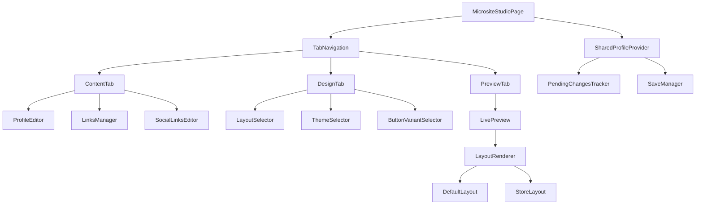
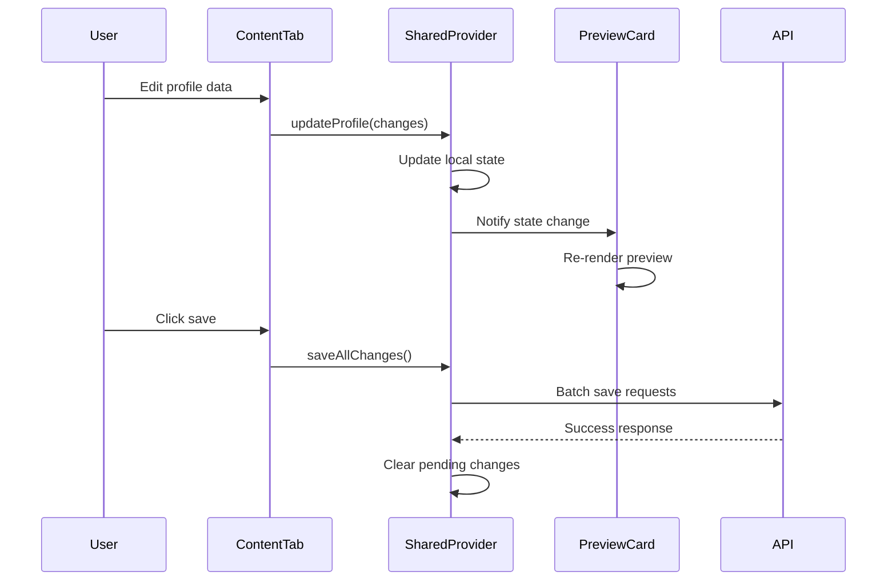

# Microsite Modular Page Design

## Overview

This design document outlines the implementation of a modular microsite page that combines content management functionality from the existing microsite page with design customization features from the design page. The solution creates a unified, tabbed interface for comprehensive microsite management with real-time preview capabilities and modular component architecture.

## Technology Stack & Dependencies

- **Frontend**: React, Next.js 15, TypeScript
- **Styling**: Tailwind CSS, CSS Custom Properties  
- **Form Management**: React Hook Form with Zod validation
- **Drag & Drop**: @dnd-kit/core, @dnd-kit/sortable
- **State Management**: TanStack Query, React hooks
- **UI Components**: Radix UI components
- **Icons**: Lucide React

## Architecture

### Modular Component Structure



### Tab-Based Interface Design

#### Tab Structure
1. **Content**: Profile information, links management, social links
2. **Design**: Layout, theme, and button variant customization  
3. **Preview**: Real-time preview with responsive testing

#### Shared State Management
- Centralized profile data management
- Unified pending changes tracking
- Cross-tab form synchronization
- Optimistic updates for immediate feedback

## Component Architecture

### Core Page Component

```typescript
interface MicrositeStudioPageProps {
  initialProfileId?: string;
}

interface SharedMicrositeData {
  profile: ProfileData;
  links: LinkData[];
  pendingChanges: PendingChanges;
  designSettings: DesignSettings;
}

interface DesignSettings {
  layoutVariant: 'default' | 'store';
  schemeVariant: 'theme1' | 'theme2';
  buttonVariant: ButtonVariant;
}

const MicrositeStudioPage: React.FC<MicrositeStudioPageProps> = ({
  initialProfileId
}) => {
  const [activeTab, setActiveTab] = useState<'content' | 'design' | 'preview'>('content');
  const [sharedData, setSharedData] = useState<SharedMicrositeData>();
  
  return (
    <div className="min-h-screen bg-background">
      <MicrositeHeader />
      <TabNavigation activeTab={activeTab} onTabChange={setActiveTab} />
      <SharedProfileProvider data={sharedData} onDataChange={setSharedData}>
        <TabContent activeTab={activeTab} />
      </SharedProfileProvider>
    </div>
  );
};
```

### Tab Components

#### Content Tab Component
```typescript
const ContentTab: React.FC = () => {
  const { profile, links, updateProfile, updateLinks } = useSharedProfile();
  
  return (
    <div className="grid grid-cols-1 lg:grid-cols-3 gap-6 p-6">
      <div className="lg:col-span-2 space-y-6">
        <ProfileEditor profile={profile} onUpdate={updateProfile} />
        <LinksManager links={links} onUpdate={updateLinks} />
      </div>
      <div className="lg:col-span-1">
        <LivePreviewCard />
      </div>
    </div>
  );
};
```

#### Design Tab Component  
```typescript
const DesignTab: React.FC = () => {
  const { designSettings, updateDesignSettings } = useSharedProfile();
  
  return (
    <div className="grid grid-cols-1 lg:grid-cols-3 gap-6 p-6">
      <div className="lg:col-span-2 space-y-6">
        <LayoutSelector 
          value={designSettings.layoutVariant}
          onChange={(value) => updateDesignSettings({ layoutVariant: value })}
        />
        <ThemeSelector
          value={designSettings.schemeVariant}
          onChange={(value) => updateDesignSettings({ schemeVariant: value })}
        />
        <ButtonVariantSelector
          value={designSettings.buttonVariant}
          onChange={(value) => updateDesignSettings({ buttonVariant: value })}
        />
      </div>
      <div className="lg:col-span-1">
        <LivePreviewCard />
      </div>
    </div>
  );
};
```

### Modular Content Components

#### ProfileEditor Component
```typescript
interface ProfileEditorProps {
  profile: ProfileData;
  onUpdate: (updates: Partial<ProfileData>) => void;
}

const ProfileEditor: React.FC<ProfileEditorProps> = ({ profile, onUpdate }) => {
  const form = useForm<ProfileFormData>({
    resolver: zodResolver(ProfileSchema),
    defaultValues: {
      displayName: profile.displayName || '',
      bio: profile.bio || '',
    }
  });
  
  const watchedValues = form.watch();
  
  useEffect(() => {
    const hasChanged = /* check for changes */;
    if (hasChanged) {
      onUpdate(watchedValues);
    }
  }, [watchedValues, onUpdate]);
  
  return (
    <Card>
      <CardHeader>
        <CardTitle>Profile Information</CardTitle>
      </CardHeader>
      <CardContent className="space-y-4">
        <AvatarUploader profile={profile} onUpdate={onUpdate} />
        <DisplayNameField form={form} />
        <BioField form={form} />
      </CardContent>
    </Card>
  );
};
```

#### LinksManager Component
```typescript
interface LinksManagerProps {
  links: LinkData[];
  onUpdate: (updates: LinksUpdate) => void;
}

const LinksManager: React.FC<LinksManagerProps> = ({ links, onUpdate }) => {
  const [localLinks, setLocalLinks] = useState(links);
  const [addLinkDialogOpen, setAddLinkDialogOpen] = useState(false);
  
  const handleDragEnd = (event: DragEndEvent) => {
    // Handle link reordering
    const reorderedLinks = handleLinkReorder(event, localLinks);
    setLocalLinks(reorderedLinks);
    onUpdate({ type: 'reorder', links: reorderedLinks });
  };
  
  return (
    <Card>
      <CardHeader className="flex flex-row items-center justify-between">
        <CardTitle>Links</CardTitle>
        <AddLinkButton onClick={() => setAddLinkDialogOpen(true)} />
      </CardHeader>
      <CardContent>
        <DndContext onDragEnd={handleDragEnd}>
          <SortableContext items={localLinks} strategy={verticalListSortingStrategy}>
            <div className="space-y-3">
              {localLinks.map(link => (
                <LinkCard
                  key={link.id}
                  link={link}
                  onUpdate={(updates) => onUpdate({ type: 'update', id: link.id, updates })}
                  onDelete={() => onUpdate({ type: 'delete', id: link.id })}
                />
              ))}
            </div>
          </SortableContext>
        </DndContext>
        
        <AddLinkDialog
          open={addLinkDialogOpen}
          onOpenChange={setAddLinkDialogOpen}
          onAdd={(data) => onUpdate({ type: 'add', data })}
        />
      </CardContent>
    </Card>
  );
};
```

#### SocialLinksEditor Component
```typescript
const SocialLinksEditor: React.FC<SocialLinksEditorProps> = ({ 
  socialLinks, 
  onUpdate 
}) => {
  const [dialogOpen, setDialogOpen] = useState(false);
  const [selectedPlatform, setSelectedPlatform] = useState<string>("");
  
  return (
    <Card>
      <CardHeader>
        <CardTitle>Social Links</CardTitle>
      </CardHeader>
      <CardContent>
        <div className="flex flex-wrap gap-2">
          {Object.entries(socialLinks || {}).map(([platform, url]) => (
            <SocialLinkButton
              key={platform}
              platform={platform}
              url={url}
              onEdit={() => handleEditSocialLink(platform)}
            />
          ))}
          <AddSocialLinkButton onClick={() => setDialogOpen(true)} />
        </div>
        
        <SocialLinksDialog
          open={dialogOpen}
          onOpenChange={setDialogOpen}
          selectedPlatform={selectedPlatform}
          onSave={(platform, url) => onUpdate({ [platform]: url })}
        />
      </CardContent>
    </Card>
  );
};
```

### Live Preview System

#### LivePreviewCard Component
```typescript
const LivePreviewCard: React.FC = () => {
  const { profile, links, designSettings } = useSharedProfile();
  const [deviceMode, setDeviceMode] = useState<'mobile' | 'tablet' | 'desktop'>('mobile');
  
  return (
    <Card className="sticky top-6">
      <CardHeader>
        <div className="flex items-center justify-between">
          <CardTitle>Live Preview</CardTitle>
          <DeviceToggle mode={deviceMode} onModeChange={setDeviceMode} />
        </div>
      </CardHeader>
      <CardContent>
        <PreviewFrame deviceMode={deviceMode}>
          <ThemeLoader schemeVariant={designSettings.schemeVariant} />
          <LayoutRenderer
            layout={designSettings.layoutVariant}
            profile={profile}
            links={links}
            buttonVariant={designSettings.buttonVariant}
          />
        </PreviewFrame>
      </CardContent>
    </Card>
  );
};
```

#### LayoutRenderer Component
```typescript
interface LayoutRendererProps {
  layout: 'default' | 'store';
  profile: ProfileData;
  links: LinkData[];
  buttonVariant: ButtonVariant;
}

const LayoutRenderer: React.FC<LayoutRendererProps> = ({
  layout,
  profile,
  links,
  buttonVariant
}) => {
  const activeLinks = links.filter(link => link.isActive)
    .sort((a, b) => a.sortOrder - b.sortOrder);
  
  switch (layout) {
    case 'store':
      return (
        <StoreLayout
          profile={profile}
          links={activeLinks}
          buttonVariant={buttonVariant}
        />
      );
    case 'default':
    default:
      return (
        <DefaultLayout
          profile={profile}
          links={activeLinks}
          buttonVariant={buttonVariant}
        />
      );
  }
};
```

### Layout Components

#### DefaultLayout Component
```typescript
const DefaultLayout: React.FC<LayoutProps> = ({ profile, links, buttonVariant }) => {
  return (
    <div className="min-h-screen flex flex-col items-center justify-center p-4 max-w-md mx-auto">
      <div className="w-full space-y-6">
        <ProfileHeader profile={profile} layout="centered" />
        <SocialLinksRow socialLinks={profile.socialLinks} />
        <LinksStack links={links} buttonVariant={buttonVariant} />
      </div>
    </div>
  );
};
```

#### StoreLayout Component
```typescript
const StoreLayout: React.FC<LayoutProps> = ({ profile, links, buttonVariant }) => {
  return (
    <div className="min-h-screen bg-background">
      <div className="max-w-4xl mx-auto p-4">
        <div className="grid grid-cols-1 md:grid-cols-3 gap-6">
          <div className="md:col-span-1">
            <ProfileHeader profile={profile} layout="compact" />
            <SocialLinksColumn socialLinks={profile.socialLinks} />
          </div>
          <div className="md:col-span-2">
            <ProductShowcase links={links} buttonVariant={buttonVariant} />
          </div>
        </div>
      </div>
    </div>
  );
};
```

## Shared State Management

### SharedProfileProvider Component
```typescript
interface SharedProfileContextType {
  profile: ProfileData;
  links: LinkData[];
  designSettings: DesignSettings;
  pendingChanges: PendingChanges;
  
  updateProfile: (updates: Partial<ProfileData>) => void;
  updateLinks: (update: LinksUpdate) => void;
  updateDesignSettings: (updates: Partial<DesignSettings>) => void;
  saveAllChanges: () => Promise<void>;
  hasUnsavedChanges: boolean;
}

const SharedProfileProvider: React.FC<SharedProfileProviderProps> = ({ 
  children,
  profileId 
}) => {
  const [profile, setProfile] = useState<ProfileData>();
  const [links, setLinks] = useState<LinkData[]>([]);
  const [designSettings, setDesignSettings] = useState<DesignSettings>();
  const [pendingChanges, setPendingChanges] = useState<PendingChanges>({
    profile: {},
    links: {},
    design: {},
    hasChanges: false
  });
  
  const updateProfile = useCallback((updates: Partial<ProfileData>) => {
    setProfile(prev => ({ ...prev, ...updates }));
    setPendingChanges(prev => ({
      ...prev,
      profile: { ...prev.profile, ...updates },
      hasChanges: true
    }));
  }, []);
  
  const saveAllChanges = useCallback(async () => {
    try {
      const promises: Promise<any>[] = [];
      
      // Save profile changes
      if (Object.keys(pendingChanges.profile).length > 0) {
        promises.push(updateProfileMutation.mutateAsync({
          id: profile.id,
          ...pendingChanges.profile
        }));
      }
      
      // Save design changes  
      if (Object.keys(pendingChanges.design).length > 0) {
        promises.push(updateProfileMutation.mutateAsync({
          id: profile.id,
          ...pendingChanges.design
        }));
      }
      
      // Save link changes
      Object.entries(pendingChanges.links).forEach(([linkId, updates]) => {
        promises.push(updateLinkMutation.mutateAsync({
          id: linkId,
          ...updates
        }));
      });
      
      await Promise.all(promises);
      
      setPendingChanges({
        profile: {},
        links: {},
        design: {},
        hasChanges: false
      });
      
      toast.success("All changes saved successfully!");
    } catch (error) {
      toast.error("Failed to save changes");
      throw error;
    }
  }, [pendingChanges, profile]);
  
  return (
    <SharedProfileContext.Provider value={{
      profile,
      links,
      designSettings,
      pendingChanges,
      updateProfile,
      updateLinks,
      updateDesignSettings,
      saveAllChanges,
      hasUnsavedChanges: pendingChanges.hasChanges
    }}>
      {children}
    </SharedProfileContext.Provider>
  );
};
```

## Data Flow Architecture

### State Update Flow



### Cross-Tab Synchronization
- Real-time state sharing between tabs
- Immediate preview updates across all tabs
- Unified save state management
- Optimistic updates with rollback capability

## File Structure

```
src/app/studio/microsite/
├── page.tsx                          # Main modular page
├── components/
│   ├── shared/
│   │   ├── SharedProfileProvider.tsx # Shared state management
│   │   ├── TabNavigation.tsx         # Tab switching component
│   │   ├── SaveManager.tsx           # Unified save functionality
│   │   └── MicrositeHeader.tsx       # Page header
│   ├── content/
│   │   ├── ContentTab.tsx            # Content management tab
│   │   ├── ProfileEditor.tsx         # Profile information editor
│   │   ├── LinksManager.tsx          # Links CRUD and reordering
│   │   ├── LinkCard.tsx              # Individual link editor
│   │   ├── SocialLinksEditor.tsx     # Social links management
│   │   └── AddLinkDialog.tsx         # Add new link modal
│   ├── design/
│   │   ├── DesignTab.tsx             # Design customization tab
│   │   ├── LayoutSelector.tsx        # Layout variant selection
│   │   ├── ThemeSelector.tsx         # Theme selection
│   │   └── ButtonVariantSelector.tsx # Button style selection
│   ├── preview/
│   │   ├── PreviewTab.tsx            # Full preview tab
│   │   ├── LivePreviewCard.tsx       # Sidebar preview
│   │   ├── PreviewFrame.tsx          # Device preview frame
│   │   ├── LayoutRenderer.tsx        # Layout switching logic
│   │   ├── DefaultLayout.tsx         # Default layout component
│   │   ├── StoreLayout.tsx           # Store layout component
│   │   ├── ProfileHeader.tsx         # Profile header variants
│   │   ├── SocialLinksRow.tsx        # Horizontal social links
│   │   ├── SocialLinksColumn.tsx     # Vertical social links
│   │   ├── LinksStack.tsx            # Vertical links list
│   │   ├── ProductShowcase.tsx       # Store layout links grid
│   │   ├── ThemeLoader.tsx           # Dynamic theme loading
│   │   └── DeviceToggle.tsx          # Preview device switching
│   └── ui/
│       ├── AvatarUploader.tsx        # Avatar upload component
│       ├── DisplayNameField.tsx      # Display name input
│       ├── BioField.tsx              # Bio textarea
│       ├── SocialLinkButton.tsx      # Social platform button
│       └── ProfileButton.tsx         # Profile link button
```

## User Experience Flow

### Tab Navigation Experience
1. **Content Tab**: Primary editing interface for profile and links
2. **Design Tab**: Visual customization with live preview
3. **Preview Tab**: Full-screen preview with device testing
4. **Persistent Preview**: Sidebar preview available across all tabs

### Save Behavior
- Auto-save draft changes to local storage
- Manual save for server persistence
- Batch save operations for performance
- Visual indicators for unsaved changes
- Confirmation dialogs for destructive actions

### Responsive Design
- Mobile-first tab interface
- Collapsible sidebar preview on small screens
- Touch-friendly drag and drop
- Progressive enhancement for desktop features

## Performance Considerations

### Optimization Strategies
- React.memo for expensive preview components
- useMemo for computed link ordering
- Debounced form inputs to reduce re-renders
- Lazy loading of design components
- Efficient state update batching

### Loading States
- Skeleton loading for initial data fetch
- Progressive loading of preview components
- Optimistic updates for immediate feedback
- Error boundaries for graceful failure handling

This modular architecture provides a comprehensive, user-friendly interface for microsite management while maintaining clean code organization and optimal performance.