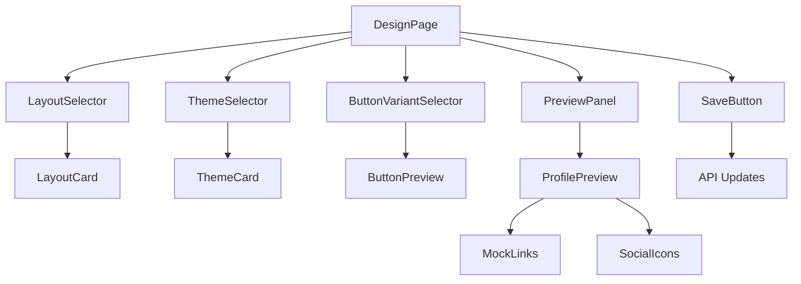
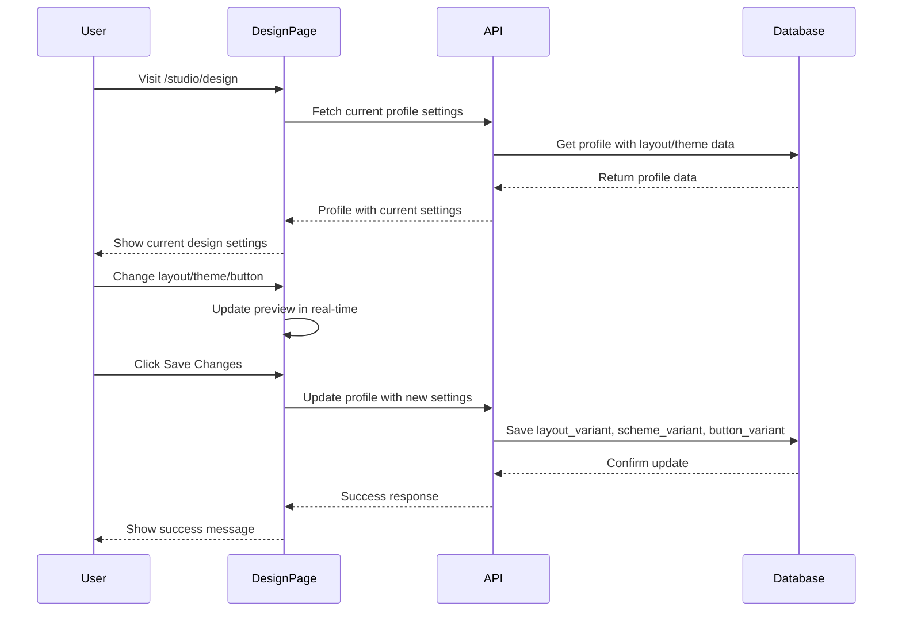

# User Layout Manager Design

## Overview

This design document outlines the implementation of a user layout/theme manager page located at `/studio/design`. This page will allow users to customize their profile's layout and theme settings through an intuitive interface. The implementation removes the complex template and color scheme system from the previous design and simplifies it to direct layout/theme variants stored in the profiles table.

## Technology Stack & Dependencies

- **Frontend**: React, Next.js, TypeScript
- **Styling**: Tailwind CSS, ShadCN UI Components
- **Database**: PostgreSQL with Drizzle ORM
- **State Management**: React Hook Form, React Query
- **Validation**: Zod validation schemas

## Architecture

### Database Schema Updates

The profiles table will include simplified layout and theme fields:

```typescript
// Profiles table fields for layout/theme management
export const profiles = pgTable("profiles", {
  // ... existing fields
  
  // Simplified layout and theme options
  layout_variant: text("layout_variant").default("default"), // "default" | "store"
  scheme_variant: text("scheme_variant").default("theme1"),  // "theme1" | "theme2" 
  button_variant: text("button_variant").default("default"), // ShadCN button variants
  
  // ... rest of existing fields
});
```

### Component Architecture



## API Updates

### Validation Schema Changes

Remove template/color scheme validation and add simplified layout/theme validation:

```typescript
// Updated ProfileCreateSchema and ProfileUpdateSchema
export const ProfileCreateSchema = z.object({
  // ... existing fields (remove layoutTemplateId, colorSchemeId)
  
  // Add simplified layout/theme fields
  layout_variant: z.enum(["default", "store"]).optional().default("default"),
  scheme_variant: z.enum(["theme1", "theme2"]).optional().default("theme1"),
  button_variant: z.enum(["default", "destructive", "outline", "secondary", "ghost", "link"]).optional().default("default"),
  
  // ... rest of existing fields
});
```

### API Endpoint Updates

Remove template-related API functions and simplify profile management:

```typescript
// Remove these functions from api.ts:
// - getTemplates
// - getLayoutTemplates 
// - getColorSchemes
// - createLayoutTemplate
// - updateLayoutTemplate
// - deleteLayoutTemplate
// - createColorScheme
// - updateColorScheme
// - deleteColorScheme

// Keep only profile-related functions for layout/theme management
// - getProfiles
// - updateProfile (with new layout/theme fields)
```

## Component Design

### Design Page Structure

```typescript
interface DesignPageProps {}

const DesignPage: React.FC<DesignPageProps> = () => {
  const [selectedLayout, setSelectedLayout] = useState<'default' | 'store'>('default');
  const [selectedTheme, setSelectedTheme] = useState<'theme1' | 'theme2'>('theme1');
  const [selectedButtonVariant, setSelectedButtonVariant] = useState<ButtonVariant>('default');
  
  return (
    <div className="p-6 space-y-6">
      <div className="flex items-center justify-between">
        <h1 className="text-2xl font-bold">Design Settings</h1>
        <Button onClick={handleSave}>
          <Save className="w-4 h-4 mr-2" />
          Save Changes
        </Button>
      </div>
      
      <div className="grid grid-cols-1 lg:grid-cols-3 gap-6">
        <div className="lg:col-span-2 space-y-6">
          <LayoutSelector />
          <ThemeSelector />
          <ButtonVariantSelector />
        </div>
        
        <div className="lg:col-span-1">
          <PreviewPanel />
        </div>
      </div>
    </div>
  );
};
```

### Layout Selector Component

```typescript
interface LayoutSelectorProps {
  selectedLayout: 'default' | 'store';
  onLayoutChange: (layout: 'default' | 'store') => void;
}

const LayoutSelector: React.FC<LayoutSelectorProps> = ({
  selectedLayout,
  onLayoutChange
}) => {
  const layouts = [
    {
      id: 'default',
      name: 'Default Layout',
      description: 'Single column centered design perfect for content creators',
      preview: '/previews/layout-default.svg'
    },
    {
      id: 'store',
      name: 'Store Layout', 
      description: 'Two-column grid optimized for showcasing digital products',
      preview: '/previews/layout-store.svg'
    }
  ];

  return (
    <Card>
      <CardHeader>
        <CardTitle>Layout Style</CardTitle>
        <CardDescription>
          Choose how your profile content is organized and displayed
        </CardDescription>
      </CardHeader>
      <CardContent>
        <div className="grid grid-cols-1 md:grid-cols-2 gap-4">
          {layouts.map((layout) => (
            <LayoutCard
              key={layout.id}
              layout={layout}
              isSelected={selectedLayout === layout.id}
              onSelect={() => onLayoutChange(layout.id as 'default' | 'store')}
            />
          ))}
        </div>
      </CardContent>
    </Card>
  );
};
```

### Theme Selector Component

```typescript
interface ThemeSelectorProps {
  selectedTheme: 'theme1' | 'theme2';
  onThemeChange: (theme: 'theme1' | 'theme2') => void;
}

const ThemeSelector: React.FC<ThemeSelectorProps> = ({
  selectedTheme,
  onThemeChange
}) => {
  const themes = [
    {
      id: 'theme1',
      name: 'Minimal Theme',
      description: 'Clean monospace design with subtle shadows',
      colors: {
        primary: '#000000',
        background: '#ffffff',
        accent: '#f5f5f5'
      }
    },
    {
      id: 'theme2', 
      name: 'Colorful Theme',
      description: 'Bold design with vibrant colors and DM Sans font',
      colors: {
        primary: '#3b82f6',
        background: '#ffffff', 
        accent: '#dbeafe'
      }
    }
  ];

  return (
    <Card>
      <CardHeader>
        <CardTitle>Color Theme</CardTitle>
        <CardDescription>
          Select the visual style and color palette for your profile
        </CardDescription>
      </CardHeader>
      <CardContent>
        <div className="grid grid-cols-1 md:grid-cols-2 gap-4">
          {themes.map((theme) => (
            <ThemeCard
              key={theme.id}
              theme={theme}
              isSelected={selectedTheme === theme.id}
              onSelect={() => onThemeChange(theme.id as 'theme1' | 'theme2')}
            />
          ))}
        </div>
      </CardContent>
    </Card>
  );
};
```

### Button Variant Selector Component

```typescript
interface ButtonVariantSelectorProps {
  selectedVariant: ButtonVariant;
  onVariantChange: (variant: ButtonVariant) => void;
}

const ButtonVariantSelector: React.FC<ButtonVariantSelectorProps> = ({
  selectedVariant,
  onVariantChange
}) => {
  const variants = [
    { id: 'default', name: 'Default', description: 'Standard button style' },
    { id: 'destructive', name: 'Destructive', description: 'Bold red styling' },
    { id: 'outline', name: 'Outline', description: 'Transparent with border' },
    { id: 'secondary', name: 'Secondary', description: 'Subtle gray styling' },
    { id: 'ghost', name: 'Ghost', description: 'Minimal hover effect' },
    { id: 'link', name: 'Link', description: 'Text-only link style' }
  ];

  return (
    <Card>
      <CardHeader>
        <CardTitle>Button Style</CardTitle>
        <CardDescription>
          Choose how your profile links and buttons will appear
        </CardDescription>
      </CardHeader>
      <CardContent>
        <div className="grid grid-cols-2 md:grid-cols-3 gap-3">
          {variants.map((variant) => (
            <Button
              key={variant.id}
              variant={variant.id as ButtonVariant}
              className={`h-auto p-3 flex flex-col items-center justify-center gap-2 ${
                selectedVariant === variant.id ? 'ring-2 ring-primary ring-offset-2' : ''
              }`}
              onClick={() => onVariantChange(variant.id as ButtonVariant)}
            >
              <span className="text-sm font-medium">{variant.name}</span>
              <span className="text-xs text-muted-foreground text-center">
                {variant.description}
              </span>
            </Button>
          ))}
        </div>
      </CardContent>
    </Card>
  );
};
```

### Preview Panel Component

```typescript
interface PreviewPanelProps {
  layout: 'default' | 'store';
  theme: 'theme1' | 'theme2';
  buttonVariant: ButtonVariant;
}

const PreviewPanel: React.FC<PreviewPanelProps> = ({
  layout,
  theme,
  buttonVariant
}) => {
  const mockProfile = {
    username: 'preview',
    displayName: 'Preview User',
    bio: 'This is how your profile will look with the selected design.',
    avatar: '/placeholder-avatar.jpg',
    socialLinks: {
      instagram: 'https://instagram.com/preview',
      twitter: 'https://twitter.com/preview'
    }
  };

  const mockLinks = [
    { id: '1', title: 'My Website', url: 'https://example.com', isActive: true },
    { id: '2', title: 'Latest Project', url: 'https://project.com', isActive: true },
    { id: '3', title: 'Portfolio', url: 'https://portfolio.com', isActive: true }
  ];

  return (
    <Card className="sticky top-6">
      <CardHeader>
        <CardTitle>Live Preview</CardTitle>
        <CardDescription>
          See how your profile will look on mobile devices
        </CardDescription>
      </CardHeader>
      <CardContent>
        <div className="w-64 h-[500px] border-4 border-foreground rounded-[2.5rem] p-2 mx-auto">
          <div 
            className={`w-full h-full rounded-[2rem] overflow-hidden theme-${theme}`}
          >
            <ProfilePreview
              profile={mockProfile}
              links={mockLinks}
              layout={layout}
              buttonVariant={buttonVariant}
            />
          </div>
        </div>
      </CardContent>
    </Card>
  );
};
```

## Data Flow

### Design Settings Management



### State Management

```typescript
interface DesignState {
  profile: ProfileData;
  selectedLayout: 'default' | 'store';
  selectedTheme: 'theme1' | 'theme2';
  selectedButtonVariant: ButtonVariant;
  isLoading: boolean;
  hasChanges: boolean;
}

const useDesignState = () => {
  const [designState, setDesignState] = useState<DesignState>();
  
  const updateLayout = (layout: 'default' | 'store') => {
    setDesignState(prev => ({
      ...prev,
      selectedLayout: layout,
      hasChanges: true
    }));
  };
  
  const updateTheme = (theme: 'theme1' | 'theme2') => {
    setDesignState(prev => ({
      ...prev,
      selectedTheme: theme,
      hasChanges: true
    }));
  };
  
  const updateButtonVariant = (variant: ButtonVariant) => {
    setDesignState(prev => ({
      ...prev,
      selectedButtonVariant: variant,
      hasChanges: true
    }));
  };
  
  return {
    designState,
    updateLayout,
    updateTheme,
    updateButtonVariant
  };
};
```

## File Structure

```
src/
├── app/
│   └── studio/
│       └── design/
│           └── page.tsx              # Main design manager page
├── components/
│   ├── design/
│   │   ├── LayoutSelector.tsx        # Layout selection component
│   │   ├── ThemeSelector.tsx         # Theme selection component  
│   │   ├── ButtonVariantSelector.tsx # Button variant selector
│   │   ├── PreviewPanel.tsx          # Live preview component
│   │   ├── LayoutCard.tsx           # Individual layout option
│   │   ├── ThemeCard.tsx            # Individual theme option
│   │   └── ProfilePreview.tsx       # Mock profile preview
│   └── ui/                          # Existing ShadCN components
├── lib/
│   ├── api.ts                       # Updated API without templates
│   ├── validation/
│   │   └── link-in-bio.ts          # Updated validation schemas
│   └── schema.ts                    # Database schema updates
└── public/
    └── previews/                    # Layout/theme preview images
        ├── layout-default.svg
        └── layout-store.svg
```

## Implementation Strategy

### Phase 1: Database & API Updates
1. Update profiles table schema with new fields
2. Remove template-related API functions from api.ts
3. Update validation schemas in link-in-bio.ts
4. Test API endpoints with new profile structure

### Phase 2: Core Components
1. Create DesignPage component structure
2. Implement LayoutSelector with layout cards
3. Implement ThemeSelector with theme previews
4. Implement ButtonVariantSelector with live examples

### Phase 3: Preview System
1. Create PreviewPanel component
2. Implement ProfilePreview with mock data
3. Add real-time preview updates
4. Test theme switching in preview

### Phase 4: State Management
1. Implement React Hook Form for form handling
2. Add React Query for API state management
3. Implement change detection and save functionality
4. Add loading and error states

### Phase 5: Integration & Testing
1. Integrate with existing studio layout
2. Add navigation from sidebar to design page
3. Test responsive design across devices
4. Implement error handling and user feedback

## Error Handling

### Validation & Fallbacks
- Validate layout/theme/button variant values on client and server
- Fallback to default values for invalid selections
- Display clear error messages for failed saves
- Implement optimistic updates with rollback on error

### User Experience
- Auto-save draft changes to local storage
- Warn users about unsaved changes when navigating away
- Provide loading states during API calls
- Show success/error toasts for user feedback

## Testing Strategy

### Unit Testing
- Test individual selector components
- Test state management hooks
- Test API validation functions
- Test preview rendering logic

### Integration Testing
- Test complete design flow from selection to save
- Test preview updates with different combinations
- Test error handling scenarios
- Test responsive behavior across screen sizes

This implementation provides a streamlined, user-friendly interface for managing profile design settings while removing the complexity of the template system and focusing on direct, simple customization options.